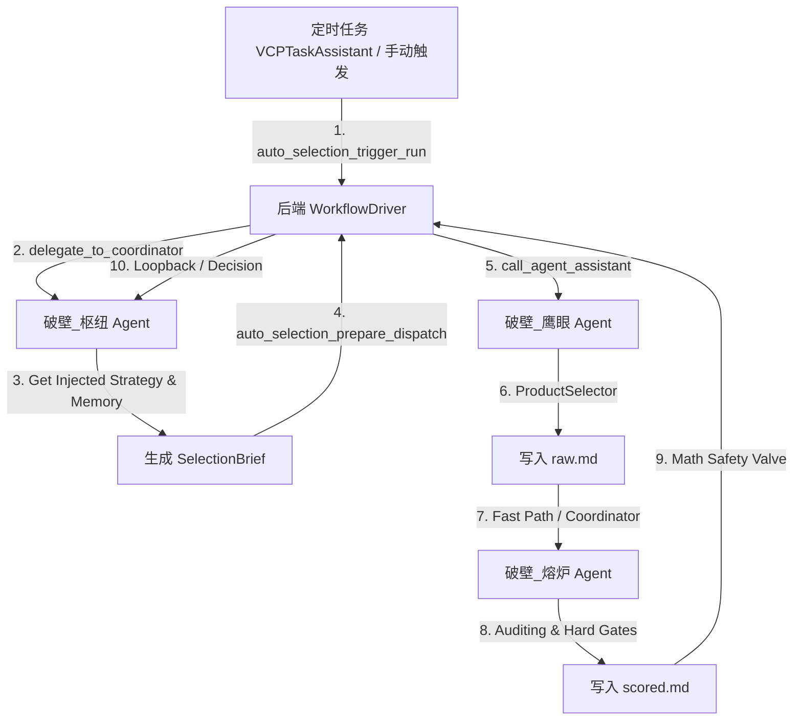

# AutoProductSelection 自动选品插件

AutoProductSelection 是自动选品工作流编排插件。它不直接抓取市场数据，而是管理 `runs/` 文件状态机、worker 锁、AgentAssistant 派发、回环守卫、评分安全阀和最终归档。

数据抓取由 `ProductSelector` 完成；任务触发可由人工或 `VCPTaskAssistant` 调用 `auto_selection_trigger_run` 完成。

## 工作流



```text
触发启动
  -> 破壁_枢纽读取策略文件并创建 brief
  -> 破壁_鹰眼读取 brief，调用 ProductSelector，写 raw
  -> 破壁_熔炉读取 raw，审计评分，写 scored
  -> 破壁_枢纽应用决策、发布、写日记、归档
  -> 工作流自动休眠
```

## 角色

- 破壁_枢纽：创建 brief、应用评审决策、发布最终报告、写入选品公共日记本。
- 破壁_鹰眼：输出 Min Evidence Pack，记录工具调用、样本量、空数据缺口和证据来源。
- 破壁_熔炉：执行 Hard Gates、四分制评分、广告压力测试、回环请求或终态裁决。

## 评分逻辑

这套系统不是简单问“这个产品热不热”，而是分四步判断：

1. **先看能不能碰**
   如果产品涉及侵权、医疗/补剂、服装鞋帽、超大件、高认证、高售后、高退货、禁售风险，或者利润已经算出来是负的，系统会直接淘汰。这个叫 Hard Gates，一票否决。

2. **再看有没有机会**
   熔炉会看需求、增长、差异化、进入门槛，得到 `OpportunityScore`。它回答的是：“这个市场本身有没有机会？”

3. **再看数据靠不靠谱**
   ProductSelector 有时抓不到冷门长尾词数据，所以系统不会把空数据当成失败。熔炉会单独给 `DataReliabilityScore`，判断数据来源、样本量、字段完整度和多来源是否互相印证。它回答的是：“我们有多确定？”

4. **最后看小卖家能不能做**
   `ExecutionFitScore` 评估资金压力、供应链复杂度、Listing 难度、售后风险、迭代速度。它回答的是：“这个机会是不是适合小卖家？”

最终动作不是只看一个孤立总分。后端会在熔炉 scored 输出后追加 v3《棱镜》数学安全阀：

```text
五支柱加权几何平均
  = 需求/增长/进入窗口
  + 竞争余地
  + 单件贡献利润与广告容错
  + 差异化与 Listing 场景代入杠杆
  + 小卖家执行适配

再生成 point_estimate ± uncertainty_band，
按 [pessimistic, optimistic] 做区间决策。
```

所以会出现几种合理结果：

- 市场不错，但数据不够：`RESEARCH_GAP` 或 `WATCHLIST`，不能直接推荐。
- 数据很可靠，但市场不好：`REJECT`。
- 市场不错，但小卖家打不动：`WATCHLIST` 或 `REJECT`。
- 机会、数据、执行都过关，且悲观估计也越过推荐线：才稳健 `RECOMMEND`。
- 中间地带会优先发布为 `WATCHLIST` 供人工验证，而不是被旧乘法链静默压死。

## 利润和广告压力怎么判断

系统会保守计算单件贡献利润：

```text
售价 - 平台佣金 - 采购成本 - 头程 - FBA - 包装 - 退货预留 - 优惠券 - 仓储预留
```

SellerSprite 的关键词转化率只是行业平均，不会被直接当成新品真实转化率。系统会自动打折：

- 默认新品/小卖家：只按原始 CVR 的 50% 做基础测试，35% 做压力测试。
- 只有证据充分、成熟低风险时，才使用稍宽松口径。

PPC 也会保守处理：不会用 low bid 做推荐依据；有 low/mid/high 时基础用 mid、压力用 high；只有单个竞价时自动放大到 1.15x / 1.35x。

如果广告获客成本吃掉了单件贡献利润，系统会阻止 `RECOMMEND`，即使市场需求看起来很漂亮。若只是 SellerSprite 派生广告字段疑似失真，v3 会降低置信度并扩大不确定带，优先观察/补采，而不是单凭 CPA 或 ACOS 淘汰。

## 策略文件

后端工作流驱动程序在派发创建 Brief 任务时，会自动读取策略文件：

```text
Plugin/AutoProductSelection/AutoSelectionStrategyProfile.zh-CN.md (优先)
或 Plugin/AutoProductSelection/AutoSelectionStrategyProfile.md (备用)
```

后端会将策略文件内容直接注入到任务提示词中。该文件默认为中文，并默认要求宽泛探索。除非文件明确写入品类、关键词、禁选方向或价格带，枢纽应从场景、人群、痛点、周边配件、收纳清洁、替换件和低成本改良角度发散。枢纽无需且不要调用 `ServerFileOperator.ReadFile` 去重复读取该文件。

## 数据协议

### RawDataPack

鹰眼写入：

```text
runs/raw/{run_id}-raw.md
```

核心字段：

- `route_decision.action`: `EARLY_REJECT | PIVOT | DEEPEN | READY_FOR_FORGE`
- `data_audit_inputs.tools_called`
- `sample_counts`
- `unfetchable_gaps`
- `keyword_market_summary`
- `competitor_summary`
- `profitability_raw_estimates`
- `review_insight_summary`
- `source_map`
- `evidence_matrix`
- `elimination_log`

兼容旧字段：`conversion_rate_matrix`、`candidate_products`、`asin_source_map`、`execution_summary.data_tools_called`。

### ScoredCandidatePack

熔炉写入：

```text
runs/scored/{run_id}-scored.md
```

核心字段：

- `hard_gates`
- `scores.opportunity_score`
- `scores.data_reliability_score`
- `scores.execution_fit_score`
- `scores.final_score`
- `financial_factors`
- `data_reliability_audit`
- `loopback_request`
- `kill_criteria`
- `next_validation_steps`

兼容旧字段：`demand_volume`、`differentiation_feasibility`、`competition_severity`、`compliance_risk`、`complexity_severity`、`data_confidence`。

## 评分安全阀

后端会在 scored 写入和应用评审决策时自动追加 `backend_math_validation_v2`：

- 记录四分：机会分、数据置信度分、执行适配分、最终分。
- 记录利润和广告压力测试：贡献利润、保守 CVR、PPC、CPA、ACOS、广告压力比例。
- 记录缺失字段：不会乐观补齐，会写入 `missing_critical_fields` 并降低数据置信度。
- 兜底阻止错误推荐：Hard Gate、负贡献利润、广告压力测试失败或低分 `RECOMMEND` 会被后端改成淘汰重选。

## 空数据容错

ProductSelector 不是 100% 有数据。冷门长尾词、过窄词或 SellerSprite 未收录时可能返回空。

- 空结果不等于商业失败。
- 鹰眼最多用同义词/父词补查 1 次。
- 同类数据连续 2 次为空后写入 `unfetchable_gaps`。
- 熔炉不得因已在 `unfetchable_gaps` 的字段继续回环，只能降低置信度并裁决。
- 429/500、账号、验证码、页面阻断属于系统阻断，应直接 failed 或 partial raw，不循环重试。

## 回环守卫

正常回环只用于 Critical Gap，并且必须有明确的 `loopback_request`。后端会拒绝以下回环：

- 缺少具体 `missing_field`、`requested_tool`、`target_keywords` 或 `target_asins`
- 字段已在 `unfetchable_gaps`
- 同一字段已有补采记录
- 普通数据回环达到软上限：global=3、scout=2

被拒绝的普通回环不会直接 failed；后端会删除旧 scored，保留 raw，重新派发 reviewer 进入 `force_decision_mode`，让熔炉基于现有证据输出终态裁决。

## 常用命令

- `auto_selection_trigger_run`
- `auto_selection_debug_status`
- `auto_selection_queue_status`
- `auto_selection_prepare_dispatch`
- `auto_selection_apply_reviewer_decision`
- `auto_selection_archive_run`

完整 API 见 `TVStxt/AutoProductSelectionToolBox.txt`。

## 运行数据

```text
Plugin/AutoProductSelection/runs/
  brief/
  raw/
  scored/
  failed/
  archived/
  locks/
```

真实运行输出和锁文件属于运行数据，不应作为稳定源码依赖。
